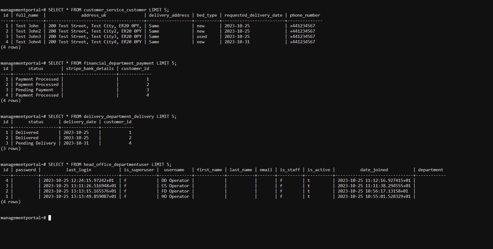
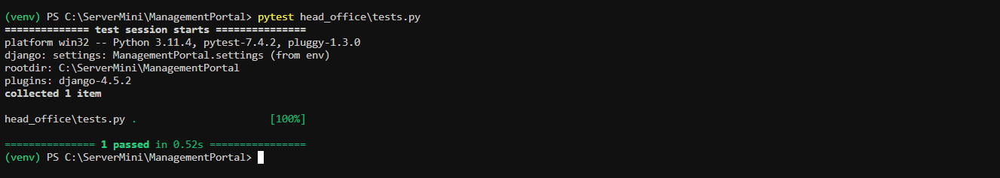
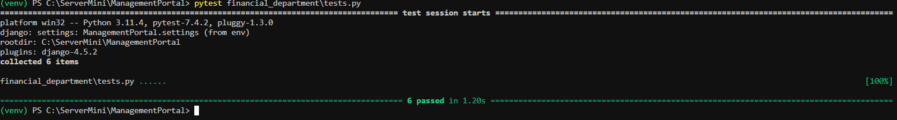
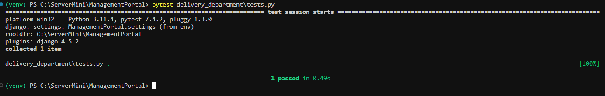

# Management Portal: Modernizing Bed Ordering Process

Welcome to the Management Portal. This platform represents the first version of my concept for a real company, aiming to offer a next-generation solution that modernizes the hospital bed ordering process. By integrating telephonic coordination with digital touchpoints, our goal is to centralize and streamline order processes to achieve optimal operational efficiency. As we continue to gather feedback and iterate, we anticipate enhancing the platform's capabilities to better serve our partners and customers.

## 📑 Table of Contents
- [Features](#features)
- [How to Use](#how-to-use)
  - [Department Login](#department-login)
  - [Customer Service](#customer-service)
  - [Financial Department](#financial-department)
  - [Delivery Management](#delivery-management)
  - [Head Office Dashboard](#head-office-dashboard)
- [Contact Details](#contact-details)
- [Security & Others](#security--others)

# Features
- 📊 **Real-time Tracking:** Stay updated on bed order status.
- 📈 **Data Analytics:** Make data-driven decisions with robust tools.

## Department Login

Access to the Management Portal begins here. Designed for simplicity, ensuring users can log in quickly.

### Components
- **Department Selection**: Choose your department from a dropdown.
- **Username**: Input your username.
- **PIN Code**: A secure field for PIN entry.
- **Login Button**: Click to enter the portal.
- **Need help to login?**: For login assistance.

### Design
- **Minimalistic**: Reducing distractions.
- **Security**: Prioritizing user data confidentiality.

## Customer Service Portal

Staff can input details of new or existing customers to optimize service delivery.

### Components
- **Full name**: For the customer's complete name.
- **Phone number**: Customer contact.
- **Address UK**: Customer's UK address.
- **Delivery address**: Where to send deliveries.
- **Bed type**: Select the desired bed type.
- **Requested delivery date**: Calendar component for choosing delivery date.

### Design
- **Intuitive**: User-friendly form layout.
- **Functional**: Error-free date selection.

## Financial Department Portal

Focused on customer payment processing and ensuring synchronization with delivery.

### Payment Processing
1. View "Pending Payments" list.
2. Click "Process Payment" to use Stripe's interface.
3. After verification, payments are processed and Delivery Department is alerted.

### Features
- Detailed payment info.
- Stripe for secure transactions.
- Notification system for payment updates.
- Error tracking for payment issues.

## Delivery Management Portal

For efficient delivery management and tracking.

### Handling Deliveries
1. View the list of deliveries.
2. Use "Pickup" for specific delivery details.
3. Mark as "Delivered" when completed.

### Features
- Notifications for overdue deliveries.
- Section for delivery pickup details.
- Guide for portal use.

## Head Office Dashboard

Centralized interface for insights into delivery, payments, and order progress.

### Overview
- **Overdue Deliveries**: List of past-due deliveries.
- **Awaiting Payments**: Tracking pending payments.
- **Scheduled Deliveries for Today**: Overview of the day's deliveries.

### Features
- Detailed informational tables.
- Contact directory for departmental communication.
- Quick logout for security.

## Contact Information
For inquiries or assistance:

- **Head Office**: +123456785
- **Customer Service**: +123456786
- **Financial Department**: +123456787
- **Delivery Department**: +123456788

# UX Plan

## Overview
ManagementPortal offers a streamlined platform for task and responsibility management across various devices.

## Responsiveness
- **Mobile-Friendly**: Adaptive design for smartphones and tablets.
- **Tablet & Desktop**: Optimized UI for larger screens.

## Strategy Plane
### User Needs
- Efficient task management.
- Organizational tools.
- Dashboard customization.
- Profile modifications.
- Admin controls.

### Business Goals
Deliver a rich application to enhance user engagement and satisfaction.

## Scope Plane
### Features
- Task creation, editing, deletion.
- Task categorization.
- Customizable dashboards.
- User profile tweaks.
- Admin controls.

## Structure Plane
Organized navigation and clear information hierarchy.

## Skeleton Plane
### UI Design
- Clear labels and indicators.
- Consistent color theme.
- Accessible controls.

## Surface Plane
### Visual Design
- Vibrant color palette (`--primary-color`, `--secondary-color`).
- Modern icons.
- Clear typography.
- Responsive design.

---

# Technologies and Frameworks Utilized

## 📑 Table of Contents
- [Web Framework](#web-framework)
- [Front-end Components](#front-end-components)
- [Backend Configuration](#backend-configuration)
- [Database](#database)
- [Authentication](#authentication)
- [Static Files Management](#static-files-management)
- [Middleware](#middleware)
- [Internationalization](#internationalization)
- [Future Technology Considerations](#future-technology-considerations)

---

## Web Framework

| Technology | Description | Documentation |
|------------|-------------|---------------|
| Django     | The primary framework powering the backend and structure of the Management Portal. | [Django Documentation](https://docs.djangoproject.com/en/3.2/topics/settings/) |

---

## Front-end Components

| Technology           | Description |
|----------------------|-------------|
| HTML5                | Utilized for webpage content structuring. |
| Materialize CSS (v1.0.0) | A front-end responsive framework, enhancing the mobile-first design and providing modern aesthetics. |
| Font Awesome (v6.3.1) | A comprehensive icon library and toolkit. |
| JavaScript & jQuery (v3.6.0) | Implements interactive web functionalities. |

---

## Backend Configuration

| Technology | Description |
|------------|-------------|
| Python     | The foundational language driving the project's server-side. |
| Installed Django Applications | Various Django modules and custom applications for functionalities, management, and payment integrations. |

---

# 🌐 Data Flow Map 

---

## ⚙️ **Django Settings**
- 🚀 **Version**: 4.2.6
- 🔑 Managed using `decouple`
- 💳 **Stripe Integration**: For payment processing
- 🗄️ **Database**: PostgreSQL
- 📦 **Apps**:
  - `managementportal`
  - `customer_service`
  - `financial_department`
  - `delivery_department`
  - `head_office`

---

## 🔒 **Authentication**
- 🌐 **Login URL**: `'/'`
- 🖥️ **View**: `customer_service_views.operator_login`
- 🚪 **Logout**: Accessible via `logout` URL

---

## 🏢 **Head Office**
- 📋 Displays:
  - 🧑‍💼 Customer info
  - 💲 Payment info
  - 🚚 Delivery info
- ❌ **Features**: Payment and delivery deletions

---

## 📞 **Customer Service**
- ➕ **Actions**:
  - Customer addition
  - Generation of payment objects

---

## 💰 **Financial Department**
- 🪙 **Stripe**: Used for payment processing
- 📅 **Post-Payment**: Assigns delivery date & creates delivery object

---

## 🚚 **Delivery Department**
- 📋 **Management**: 
  - Delivery details
  - Delivery statuses (e.g., marked as delivered)

---

## 🔗 **URL Configuration**
- 🕸️ **Primary**: Configuration in `managementportal`
- 🌐 **Base URL**: `'/'` redirects to the login page
- 📁 **Departmental URLs**: Separate sets for:
  - `customer_service`
  - `financial_department`
  - `delivery_department`
  - `head_office`

---

## 🤝 **Relationships**
- 🧑‍💼 **Customer**: Individual representation
- 💲 **Payment**: Linked with `Customer`, manages details
- 📦 **Delivery**: Linked with `Customer`, manages details & status
- 🚪 **DepartmentUser**: Represents department operators, manages authentication

----

## Database

| Technology | Description |
|------------|-------------|
| PostgreSQL | The primary relational database system employed, leveraging Django's `dj_database_url` for efficient database URL parsing and connection management. |

---

## Authentication

| Technology | Description |
|------------|-------------|
| Django's Authentication | Using Django's inbuilt user authentication and session management. |
| Password Validators | In-built Django password validators to ensure password strength and security. |

---

## Static Files Management

| Technology | Description |
|------------|-------------|
| WhiteNoise | Handles static file serving with the aid of compressed manifest storage. |
| Materialize CSS & Font Awesome | Employed for design aesthetics and icons respectively. |

---

## Middleware

| Technology | Description |
|------------|-------------|
| Django Middleware | Incorporates security, session management, CSRF protection, and other essential web processes. |
| WhiteNoise Middleware | For efficient static file serving. |

---

## Internationalization

| Technology | Description |
|------------|-------------|
| Locale     | `en-us` indicating the primary language and locale as English (United States). |
| Timezone   | Coordinated Universal Time (UTC) is used. |

---

# Future Technology Considerations

| Technology Category | Description |
|---------------------|-------------|
| **Warehouse Operator System** | Planning to complete the warehouse operator system software with scanning capabilities. This will streamline the inventory management and tracking process. |
| **Automatic Invoicing** | Introducing an automatic invoicing system to simplify the billing process and ensure timely and accurate billing. |
| **Delivery Live Tracking** | Incorporating live tracking of deliveries, allowing customers to track their rented beds in real-time and anticipate delivery times more accurately. |
| **Bed Rental System** | Updating the service structure to enable customers to rent beds. This will enhance flexibility and offer customers a more tailored solution. |
| **Mobile App Development** | Exploring the development of a dedicated mobile application using frameworks like React Native or Flutter. This would enhance accessibility and user engagement on mobile devices. |
| **AI Integration** | Implementing AI and ML libraries to enable intelligent decision-making, predictive analytics, and personalized recommendations for users. |
| **Advanced Security Measures** | Enhancing security with technologies like MFA, biometric authentication, and blockchain-based solutions. 
| **Enhanced Analytics and Reporting** | Integrating advanced analytics and reporting tools for deeper insights, customizable dashboards, and interactive reports. |

---

# Tests and results

## **All Main Functions Tested with Pytest and Passed**

Below is a list of functions in the Management Portal project that have been tested with Pytest and have passed:

| Function Name         | Description                                                                                     |
|-----------------------|-------------------------------------------------------------------------------------------------|
| **`operator_login`**  | Handles operator login and authentication.                                                      |
| **`add_customer`**    | Allows operators to add customers to the system and creates pending payment records for them.  |
| **`view_head_office`**| Displays pending customers, pending payments, out-for-delivery items, and overdue deliveries.  |

| **`view_payments`**   | Displays pending payment records in the financial department view and handles payment processing. |
| **`process_payment`** | Processes payments for customers, charges the customer's credit card using the Stripe API, and updates the payment status. |

| **`view_deliveries`** | Displays all future deliveries, today's deliveries, and overdue deliveries for the delivery department. |

| **`update_delivery`** | Allows updating the status of a specific delivery to "Delivered." |

---

**These functions have been thoroughly tested with Pytest to ensure their functionality and correctness.**
---

# **🚀 Deployment**

*ManagementPortal* is an innovative web application crafted to optimize management processes. Ensuring it's available to users globally, the deployment strategy plays a pivotal role.

- **Platform**: The app is securely hosted on **Heroku**, a robust cloud solution renowned for effortless deployment, scalability, and superior management of web applications. The icing on the cake? Seamless integration with the project's GitHub repository.

---

## **🔗 Version Control**

Version control remains at the heart of *ManagementPortal*, encouraging collaboration, meticulous code organization, and an eagle-eyed tracking of every code modification.

- **Git & GitHub**: While Git paves the way for multiple developers to work together, GitHub offers an online hub to store Git repositories, complemented by collaboration tools.
  
- **Commit History**: Reflects each adjustment made to the codebase. Every commit comes with a clear, concise message that unravels the reason behind the change.
  
- **Branching Strategy**: A structured approach is in place to tackle features, bugs, and development phases. While the main branch showcases a production-ready version, feature branches focus on new additions or specific fixes. Comprehensive reviews prior to any merges ensure code integrity.
  
- **Release Tagging**: Essential for marking significant milestones or versions, assisting in easy referencing when needed.
  
- **Collaboration & Contribution**: Keen to make a mark? Fork the repository, make your changes, and put forth pull requests to enhance the main codebase. Regular reviews and discussions ensure the gold standard of quality is maintained.
  
- **Continuous Integration**: GitHub Actions drive the CI, running automated tests for each PR and push, ensuring nothing breaks the existing rhythm.

---

### **🤝 How to Contribute**

Desiring to be a part of *ManagementPortal*? Here's how:

1. Fork the repository on GitHub.
2. Get the forked repository on your local machine.
3. Kickstart a new branch.
4. Make and commit your changes.
5. Push to your GitHub repository.
6. Open a pull request to the main branch of the original repo.
7. Dive into the code review and make necessary tweaks.

---

## **📚 Resources**

*ManagementPortal*'s success can be attributed to a wealth of online platforms:

- **[Code Institute](https://codeinstitute.net/)**: A treasure trove of web development tutorials and materials.
- **[Google](https://www.google.com/)**: The go-to for solutions to all coding challenges.
- **[YouTube](https://www.youtube.com/)**: A sea of coding tutorials and walkthroughs.
- **[freeCodeCamp](https://www.freecodecamp.org/)**: A haven for free coding lessons and resources.
- **[Google Developers Training](https://developers.google.com/training)**: Comprehensive courses on various development topics provided by Google.
- **[IBM Developer](https://developer.ibm.com/)**: A platform by IBM offering a wide range of tutorials, code patterns, and APIs to enhance development skills.

A heartfelt gratitude to the numerous creators and educators who've shared their expertise.

---

## **🏆 Credits**

#### **Code and Content**
Every line of code and content, painstakingly penned down by [Sandor Gyorfi](https://github.com/sandorgyorfi). Your dedication towards crafting a premier portal management tool is commendable.

### **Acknowledgements**
Very Thanks to:

- Ben Smith, Pasquale Fasulo from City of Bristol College.
- The Code Institute.

For their insights, resources, and unwavering support.

---

## **📞 Contact**
Queries? Feedback? Drop an email at [mr.sandorgyorfi@gmail.com](mailto:mr.sandorgyorfi@gmail.com).

---

